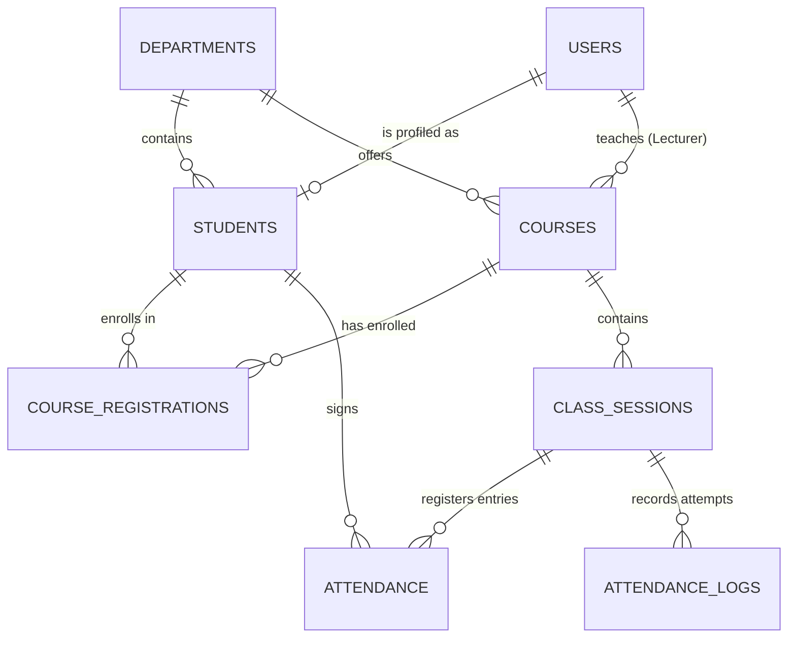

# Attendance Management System - Database Design

This document details the database schema, entity relationships (ERD), table structure, indexing strategy, and anti-fraud mechanisms built directly into the database layer.

---

## 1. Entity Relationship Diagram (ERD)

The diagram below represents the tables, attributes, and relationships. It enforces strict relational constraints to block illegal registrations and ensure traceability.

---

## 2. Table Schemas & Relationships

The database utilizes **UUIDs** (`uuid_generate_v4()`) for all unique identifiers rather than incremental integers. This provides security against ID enumeration, scaling capacity across multiple campuses, and clean offline generation capability.

### 2.1 `departments`
Holds university departments and their parent faculties.
- **`id`** `UUID` (Primary Key): Unique identifier.
- **`name`** `VARCHAR(100)` (Unique, Indexed): Department name (e.g., "Computer Science").
- **`faculty`** `VARCHAR(100)`: Faculty name (e.g., "Science and Computing").
- **`created_at`** `TIMESTAMP`: Metadata audit timestamp.

### 2.2 `users`
Core login credentials and role classifications.
- **`id`** `UUID` (Primary Key): Matches student or lecturer session.
- **`email`** `VARCHAR(150)` (Unique, Indexed): Valid school email address.
- **`password_hash`** `VARCHAR(255)`: Bcrypt-hashed password.
- **`role`** `VARCHAR(20)`: System roles, restricted to `'lecturer'` and `'student'`.
- **`created_at`** / **`updated_at`** `TIMESTAMP`: Timestamps for changes.

### 2.3 `students`
Student-specific profile extensions.
- **`id`** `UUID` (Primary Key): Unique student ID.
- **`user_id`** `UUID` (Foreign Key -> `users.id`, Cascade Delete): References the credential record.
- **`matric_number`** `VARCHAR(30)` (Unique, Indexed): Unique registration number.
- **`full_name`** `VARCHAR(150)`: Student's name.
- **`department_id`** `UUID` (Foreign Key -> `departments.id`, Restrict Delete): Student's home department.
- **`level`** `INT`: 100, 200, 300, 400, or 500 level.
- **`school_email`** `VARCHAR(150)` (Unique): Duplicated for fast reference and profile joining.

### 2.4 `courses`
Academic courses offered.
- **`id`** `UUID` (Primary Key): Unique identifier.
- **`course_code`** `VARCHAR(20)` (Unique, Indexed): Code (e.g., "CSC301").
- **`course_title`** `VARCHAR(150)`: Long name.
- **`department_id`** `UUID` (Foreign Key -> `departments.id`, Restrict Delete): Department offering the course.
- **`level`** `INT`: Course level (100–500).
- **`lecturer_id`** `UUID` (Foreign Key -> `users.id`, Restrict Delete): The instructor assigned.

### 2.5 `course_registrations`
Enrolled students list.
- **`student_id`** `UUID` (Foreign Key -> `students.id`, Cascade Delete)
- **`course_id`** `UUID` (Foreign Key -> `courses.id`, Cascade Delete)
- **`registration_date`** `TIMESTAMP`: Date enrolled.
- **Constraint**: `UNIQUE(student_id, course_id)` prevents dual registration.

### 2.6 `class_sessions`
Weekly occurrences of a course.
- **`id`** `UUID` (Primary Key)
- **`course_id`** `UUID` (Foreign Key -> `courses.id`, Cascade Delete)
- **`session_name`** `VARCHAR(150)`: e.g., "Lecture 1".
- **`date`** `DATE` / **`start_time` / `end_time`** `TIME`: Session schedule bounds.
- **`room_location`** `VARCHAR(100)`: Venue name.
- **`latitude`** / **`longitude`** `DECIMAL(10,8) / DECIMAL(11,8)`: Coordinates of classroom centre.
- **`allowed_radius_meters`** `INT` (Default 50): GPS validation boundary.
- **`is_active`** `BOOLEAN` (Default FALSE): Controlled by the lecturer to open/close scanning.
- **`qr_secret_salt`** `VARCHAR(100)`: Dynamic salt generated when session opens, used to verify the QR tokens.

### 2.7 `attendance`
Final records of verified attendance.
- **`id`** `UUID` (Primary Key)
- **`class_session_id`** `UUID` (Foreign Key -> `class_sessions.id`, Cascade Delete)
- **`student_id`** `UUID` (Foreign Key -> `students.id`, Cascade Delete)
- **`status`** `VARCHAR(20)`: `'present'`, `'absent'`, or `'late'`.
- **`signed_at`** `TIMESTAMP`: Time they successfully signed.
- **`device_fingerprint`** `VARCHAR(255)`: Browser fingerprint of submission.
- **`ip_address`** `VARCHAR(45)`: Submission IP address.
- **`distance_meters`** `DECIMAL(6,2)`: Evaluated distance from classroom center.
- **`verified_gps`** `BOOLEAN`: Set to TRUE only when GPS coordinates pass checks.
- **Constraint**: `UNIQUE(class_session_id, student_id)` prevents double entries.

### 2.8 `attendance_logs`
Logs of every attempt to sign (auditing & debugging).
- **`id`** `UUID` (Primary Key)
- **`class_session_id`** `UUID` (Foreign Key -> `class_sessions.id`)
- **`matric_number`** `VARCHAR(30)`: Attempted matric number.
- **`ip_address`** `VARCHAR(45)`: Attempter's IP.
- **`device_fingerprint`** `VARCHAR(255)`: Browser fingerprint of submitter.
- **`status`** `VARCHAR(20)`: `'success'` or `'failed'`.
- **`failure_reason`** `VARCHAR(255)`: e.g., "Outside GPS radius", "Expired QR".
- **`latitude` / `longitude`** `DECIMAL`
- **`attempted_at`** `TIMESTAMP`

### 2.9 `attendance_reports`
- **`id`** `UUID` (Primary Key)
- **`course_id`** `UUID` (Foreign Key -> `courses.id`)
- **`report_name`** `VARCHAR(150)`
- **`generated_at`** `TIMESTAMP`
- **`file_path`** `VARCHAR(255)`: Path to saved static sheet.
- **`report_type`** `VARCHAR(20)`: `'excel'` or `'pdf'`.

---

## 3. Anti-Fraud & Performance Database Measures

1. **Duplicate Submission Prevention**: The unique constraint on `uq_attendance_session_student` in the `attendance` table is a hard barrier. Once an attendance record is created for a user in a session, all subsequent attempts fail at the database level.
2. **Proxy Detection via Device Fingerprint**: A compound index is created on `attendance(class_session_id, device_fingerprint)`. If a student attempts to register another classmate using their own device, the backend will query this index to verify whether the `device_fingerprint` has already signed.
3. **Audit Trail**: Every check failure (e.g. wrong department, wrong location, expired token) is logged into `attendance_logs`. If multiple failures occur on a single IP or fingerprint within minutes, the system will flag the matric numbers for administrative review.
4. **Performance Indexes**: Indexes on foreign keys and lookup values (`idx_users_email`, `idx_students_matric`, `idx_registrations_course`, `idx_attendance_session`) prevent slow joins when generating reports.
